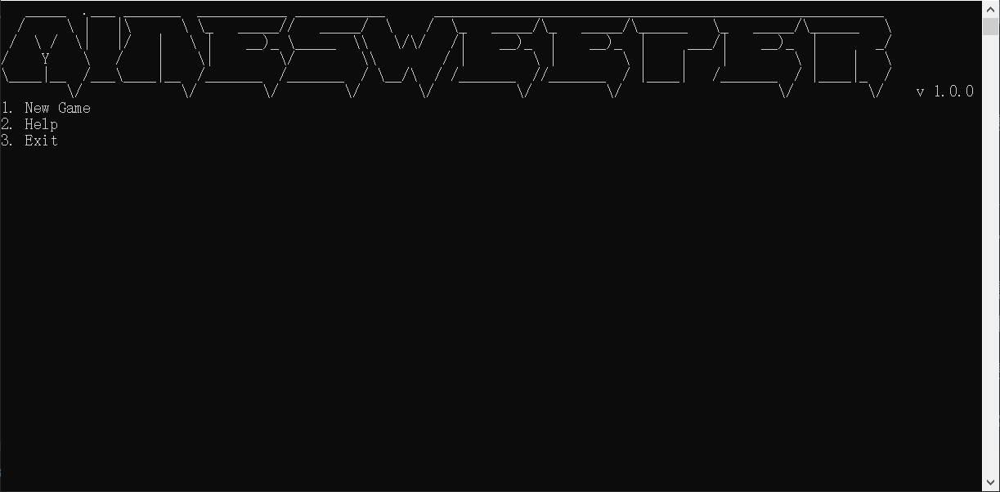
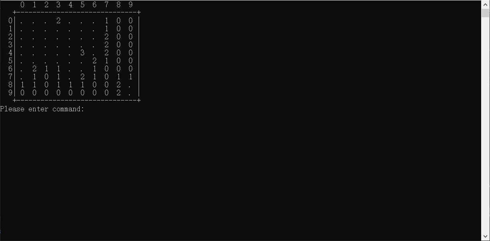
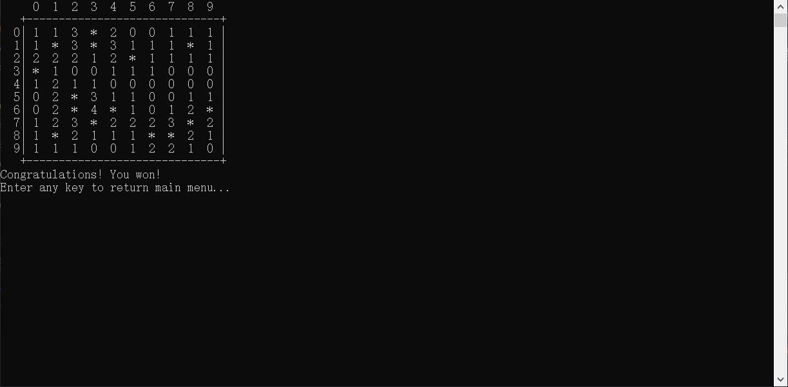
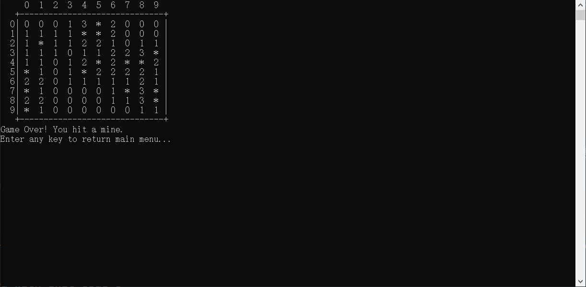

# Minesweeper

💣 经典扫雷游戏来袭！~ 💥

深度编码小组首个Github合作项目。

### 概览

本作品采用命令行玩法，回归复古与经典~

你需要在一个10*10的网格地图中，将所有没有埋雷的格子全部掀开以获得胜利。

已经掀开的格子上的数字表示此位置周围的8个格子中一共有多少颗地雷。

但是小心不要踩到地雷！否则就会被炸的稀巴烂！！💣💥 

祝你好运~

### 版本信息
v1.0.0: 第一个正式版，采用一首主BGM和两个音效。主菜单支持开始新游戏、帮助查询、退出三个选项。